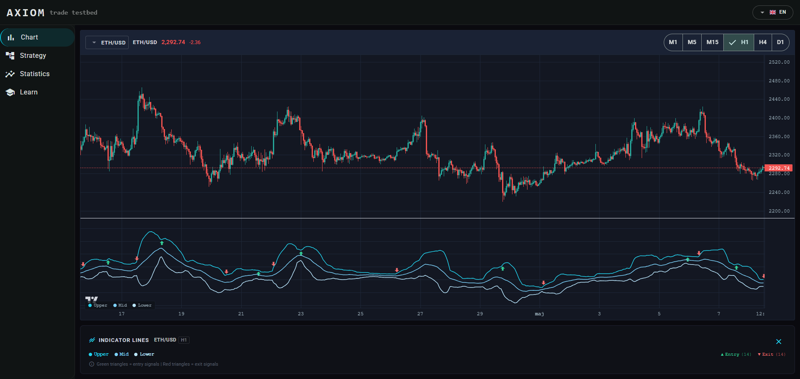
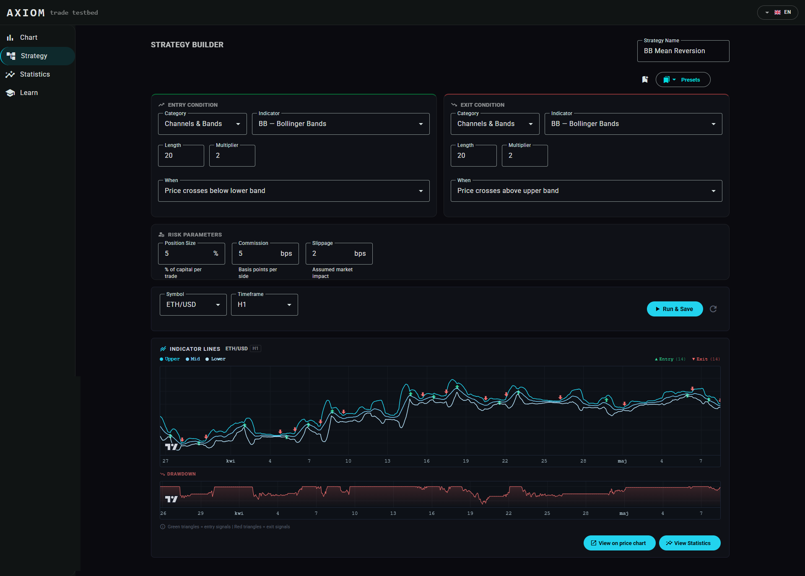
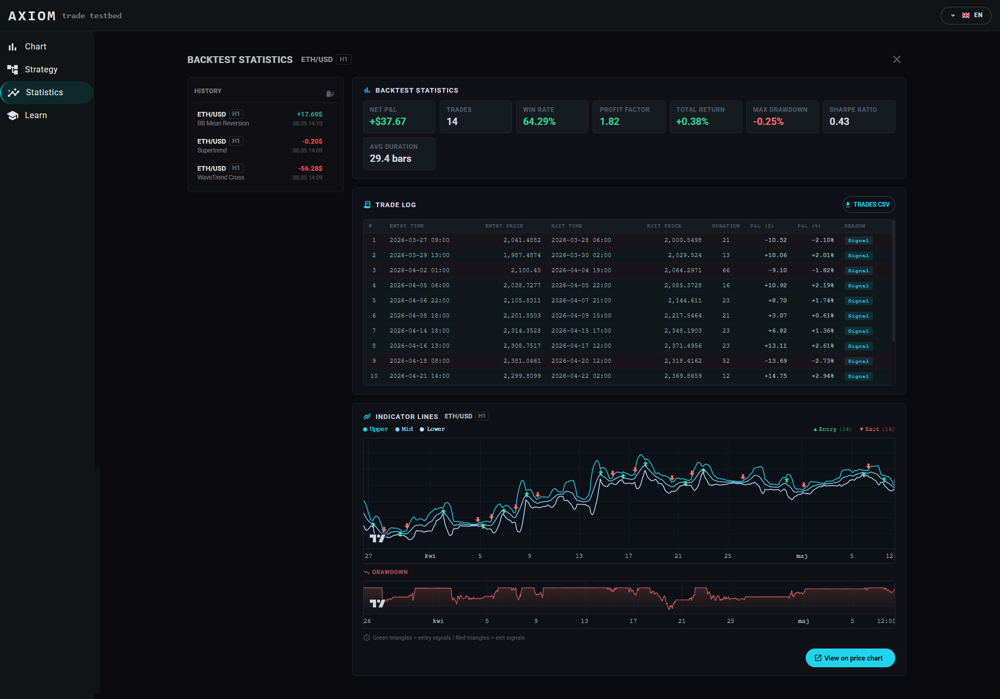

# Axiom Trade Testbed

**Przeglądarkowa platforma do budowania strategii tradingowych i backtestingu — bez serwera, bez bazy danych, bez instalacji.**


**[Live Demo](https://axiom-trade-testbed.netlify.app/)**

[🇬🇧 English](README.md) | 🇵🇱 Polski

---

## Czym jest ten projekt

Axiom Trade Testbed to w pełni klientowa aplikacja Angular, która pozwala zbudować strategię tradingową bez pisania kodu — z ponad 80 wskaźnikami technicznymi — a następnie uruchomić symulację bar-po-barze na żywych danych rynkowych z Binance lub Alpaca i przeanalizować wyniki przez interaktywną krzywą equity, log transakcji i panel statystyk.

Nie ma backendu. Wszystkie obliczenia wykonywane są w przeglądarce, dane pobierane są bezpośrednio z publicznych API giełd, a stan aplikacji (presety strategii, historia backtestów) przechowywany jest w `localStorage`.

---

## Funkcjonalności

### Wykres na żywo



- Wykres świecowy w czasie rzeczywistym oparty na **Lightweight Charts v5**
- Strumieniowanie cen przez **WebSocket Binance** dla par krypto (BTC, ETH, SOL, DOGE, AVAX)
- Historyczne dane OHLCV z **Alpaca** dla akcji notowanych w USA
- Interwały: M1 · M5 · M15 · H1 · H4 · D1
- Selektor symboli — kryptowaluty i akcje w jednym miejscu

### Kreator strategii



- Wizualny edytor no-code — wybór wskaźników wejścia i wyjścia z katalogu
- Cztery sloty wskaźników: wejście-główny, wejście-pomocniczy, wyjście-główny, wyjście-pomocniczy
- **Ponad 20 warunków sygnałowych**: przecięcie, próg, dywergencja, powyżej/poniżej pasma, histogram MACD, cena vs. wskaźnik i inne
- Parametry ryzyka: prowizja (bps), poślizg (bps), rozmiar pozycji (% kapitału)
- Zapis, odtwarzanie i usuwanie **presetów użytkownika** (persystowane w `localStorage`)
- Wbudowane presety strategii do szybkiej eksploracji

### Statystyki i backtesting



- Wykres krzywej equity z oznaczeniami wejść i wyjść z transakcji
- Wykres obszarowy drawdownu
- Pełna tabela transakcji (cena wejścia/wyjścia, P&L, liczba barów, powód zamknięcia)
- Pasek boczny historii backtestów — wszystkie poprzednie sesje zachowane między odświeżeniami
- **Metryki wynikowe:** Całkowity zwrot · Net P&L · Maks. drawdown · Win rate · Profit factor · Sharpe ratio (annualizowany, √252) · Średni czas trwania transakcji

### Moduł nauki

.png)

- Słownik finansowy: 11 grup tematycznych, 117 pojęć
- Wyszukiwanie pełnotekstowe
- Wzory matematyczne renderowane przez **KaTeX**

### Internacjonalizacja
- Polski / Angielski (PL · EN) — przełączany w czasie działania aplikacji
- Wszystkie ciągi UI, nazwy wskaźników, opisy parametrów i legendy wzorów obsługują i18n

---

## Stack technologiczny

| Warstwa | Technologia |
|---|---|
| Framework | Angular 21 (standalone components, signals, lazy routes) |
| Język | TypeScript 5 |
| Wykresy | Lightweight Charts v5 |
| Komponenty UI | Angular Material |
| Warstwa reaktywna | RxJS 7 |
| Dane rynkowe — krypto | Binance REST API + WebSocket |
| Dane rynkowe — akcje | Alpaca Markets REST API |
| Renderowanie wzorów | KaTeX |
| Persystencja stanu | `localStorage` (bez backendu) |
| Build | Angular CLI / esbuild |

---

## Jak to działa

### Rejestr wskaźników

Każdy wskaźnik (80+) to osobny moduł TypeScript wywołujący `registerIndicator()` przy imporcie. Plik barrel `src/app/core/indicators/index.ts` importuje wszystkie moduły jako efekty uboczne, wypełniając rejestr przy starcie aplikacji. Kreator strategii odczytuje rejestr do wyrenderowania katalogu, a silnik backtestowy wyszukuje wskaźniki po kluczu w czasie wykonania.

Kategorie wskaźników: Średnie kroczące · Oscylatory · Momentum · Trend · Zmienność · Wolumen · Kanały i pasma · Wzorce świecowe

### Silnik backtestowy (`BacktestEngineService`)

```
pobierz bary OHLCV  →  oblicz tablice wskaźników  →  pętla bar-po-barze
                                                              │
                                                  oceń warunek wejścia
                                                              │
                                             [w pozycji] oceń warunek wyjścia
                                                              │
                                          zapisz transakcję · aktualizuj equity
                                                              │
                                         oblicz metryki zbiorcze → BacktestResult
```

Ewaluator warunków (`condition-evaluator.ts`) normalizuje heterogeniczne kształty wyjść wskaźników (pojedynczy skalar, dwie linie, trójka MACD, trójka pasm, Ichimoku, Alligator…) do jednolitego interfejsu porównawczego, dzięki czemu wszystkie ponad 20 typów warunków działa z dowolną kombinacją wskaźników.

### Przepływ danych

```
Binance WS (real-time)  ─┐
                          ├──► ChartComponent  ──► Lightweight Charts
Alpaca REST (historical) ─┘

Alpaca / Binance REST ──► BacktestRunnerComponent ──► BacktestEngineService
                                                              │
                                                     BacktestStore (signals)
                                                              │
                                          BacktestChartComponent  +  StatsPanel
```

### Zarządzanie stanem

W całej aplikacji używane są Angular signals — nie ma NgRx ani zewnętrznego store'a. `StrategyStore` i `BacktestStore` to serwisy `@Injectable({ providedIn: 'root' })` eksponujące wartości `signal()` i `computed()` bezpośrednio konsumowane przez komponenty.

---

## Uruchomienie lokalne

### Wymagania

- Node.js 20+
- Klucz API **Alpaca** (konto paper-trading, bezpłatne na [alpaca.markets](https://alpaca.markets)) dla danych akcji

### Instalacja

```bash
git clone https://github.com/Stasiek99/axiom-trade-testbed.git
cd axiom-trade-testbed
npm install
```

Utwórz plik `.env` w katalogu głównym projektu:

```env
ALPACA_API_KEY=twoj_klucz
ALPACA_API_SECRET=twoj_sekret
```

```bash
npm start
# → http://localhost:4200
```

Dane krypto (Binance) działają bez klucza API. Dane akcji wymagają powyższych poświadczeń Alpaca.

---

## Struktura projektu

```
src/app/
├── core/
│   ├── backtest/           # silnik, modele, store, ewaluator warunków
│   ├── indicators/         # 80+ wskaźników — moduły samorejestrujące
│   │   ├── moving-averages/
│   │   ├── oscillators/
│   │   ├── momentum/
│   │   ├── trend/
│   │   ├── volatility/
│   │   ├── volume/
│   │   └── channels-bands/
│   ├── strategy/           # model strategii, store, presety
│   ├── services/           # Binance REST, Binance WS, Alpaca REST
│   └── i18n/               # tłumaczenia, nazwy wskaźników, legendy wzorów
└── features/
    ├── chart/              # wykres na żywo + selektor symboli
    ├── strategy-builder/   # edytor strategii, runner backtestów, log transakcji
    ├── statistics/         # krzywa equity, drawdown, pasek historii
    └── learn/              # słownik z wyszukiwaniem i wzorami KaTeX
```

---

## Licencja

MIT
